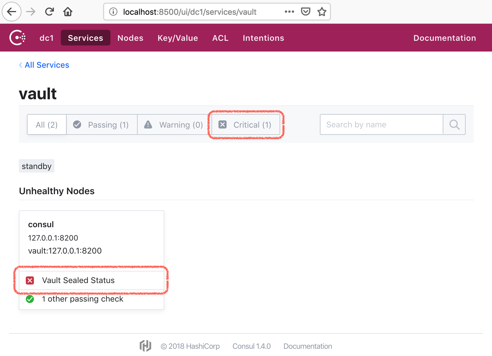
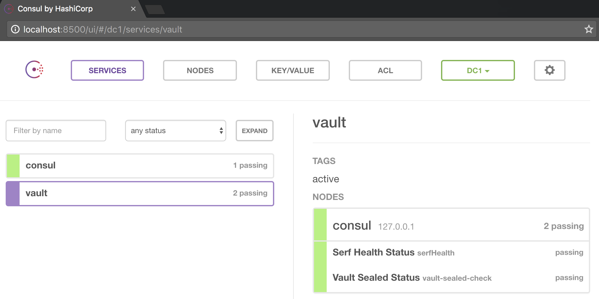
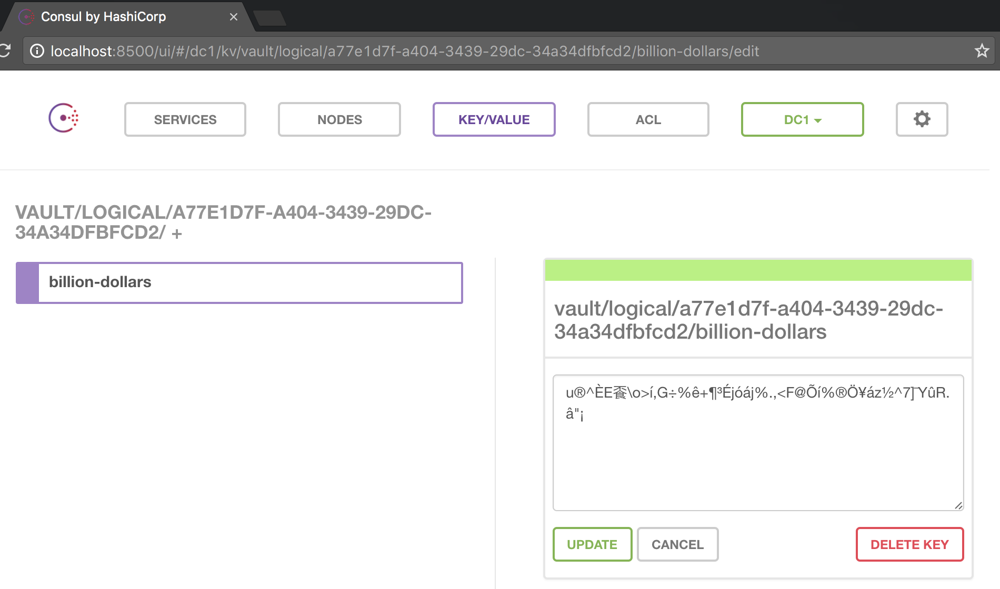

# cault

Consul and Vault are started together in two separate, but linked, docker containers.

Vault is configured to use a `consul` [secret backend](https://www.vaultproject.io/docs/secrets/consul/).

---

- [Start Consul and Vault](#start-consul-and-vault)
- [Getting Vault Ready](#getting-vault-ready)
  - [Init Vault](#init-vault)
  - [Unsealing Vault](#unsealing-vault)
  - [Auth with Vault](#auth-with-vault)
- [Making sure it actually works](#making-sure-it-actually-works)
  - [Watch Consul logs](#watch-consul-logs)
  - [Writing / Reading Secrets](#writing--reading-secrets)
  - [Response Wrapping](#response-wrapping)
- [Troubleshooting](#troubleshooting)
  - [Bad Image Caches](bad-image-caches)
- [License](#license)

## Start Consul and Vault

```bash
docker-compose up -d
```

## Getting Vault Ready

Login to the Vault image:

```bash
docker exec -it cault_vault_1 sh
```

Check Vault's status:

```bash
$ vault status
Error checking seal status: Error making API request.

URL: GET http://127.0.0.1:8200/v1/sys/seal-status
Code: 400. Errors:

* server is not yet initialized
```

Because Vault is not yet initialized, it is sealed, that's why Consul will show you a sealed critial status:

<p align="center"></p>

### Init Vault

```bash
$ vault init
Unseal Key 1: d28dc3e20848c499749450b411bdc55416cefb0ff6ddefd01ec02088aa5c90aa01
Unseal Key 2: ad2b7e9d02d0c1cb5b98fafbc2e3ea56bd4d4fa112a0c61882c1179d6c6585f302
Unseal Key 3: c393269f177ba3d07b14dbf14e25a325205dfbf5c91769b8e55bf91aff693ce603
Unseal Key 4: 87c605e5f766d2f76d39756b486cbdafbb1998e72d2f766c40911f1a288e53a404
Unseal Key 5: e97e5de7e2cdb0ec4db55461c4aaf4dc26092cb3f698d9cc270bf19dbb82eab105
Initial Root Token: 5a4a7e11-1e2f-6f76-170e-b8ec58cd2da5

Vault initialized with 5 keys and a key threshold of 3. Please
securely distribute the above keys. When the Vault is re-sealed,
restarted, or stopped, you must provide at least 3 of these keys
to unseal it again.

Vault does not store the master key. Without at least 3 keys,
your Vault will remain permanently sealed.
```

notice Vault says:

> you must provide at least 3 of these keys to unseal it again

hence it needs to be unsealed 3 times with 3 different keys (out of the 5 above)

### Unsealing Vault

```bash
$ vault unseal
Key (will be hidden):
Sealed: true
Key Shares: 5
Key Threshold: 3
Unseal Progress: 1

$ vault unseal
Key (will be hidden):
Sealed: true
Key Shares: 5
Key Threshold: 3
Unseal Progress: 2

$ vault unseal
Key (will be hidden):
Sealed: false
Key Shares: 5
Key Threshold: 3
Unseal Progress: 0
```

the Vault is now unsealed:

<p align="center"></p>

### Auth with Vault

We can use the `Initial Root Token` from above to auth with the Vault:

```bash
$ vault auth
Token (will be hidden):
Successfully authenticated! You are now logged in.
token: 5a4a7e11-1e2f-6f76-170e-b8ec58cd2da5
token_duration: 0
token_policies: [root]
```

---

All done: now you have both Consul and Vault running side by side.

## Making sure it actually works

From the host environment (i.e. outside of the docker image):

```bash
alias vault='docker exec -it cault_vault_1 vault "$@"'
```

This will allow to run `vault` commands without a need to logging in to the image.

> the reason commands will work is because you just `auth`'ed (logged into Vault) with a root token inside the image in the previous step.

### Watch Consul logs

In one terminal tail Consul logs:

```bash
$ docker logs cault_consul_1 -f
```

### Writing / Reading Secrets

In the other terminal run vault commands:

```bash
$ vault write -address=http://127.0.0.1:8200 secret/billion-dollars value=behind-super-secret-password
```
```
Success! Data written to: secret/billion-dollars
```

Check the Consul log, you should see something like:

```bash
2016/12/28 06:52:09 [DEBUG] http: Request PUT /v1/kv/vault/logical/a77e1d7f-a404-3439-29dc-34a34dfbfcd2/billion-dollars (199.657µs) from=172.28.0.3:50260
```

Let's read it back:

```bash
$ vault read secret/billion-dollars
```
```
Key             	Value
---             	-----
refresh_interval	2592000
value           	behind-super-secret-password
```

And it is in fact in Consul:

<p align="center"></p>

### Response Wrapping

Running with a [Cubbyhole Secret Backend](https://www.vaultproject.io/docs/secrets/cubbyhole/index.html).

> _NOTE: for this example to work you would need [jq](https://stedolan.github.io/jq/) (i.e. to parse JSON responses from Vault)._

> _`brew install jq` or `apt-get install jq` or similar_

Export Vault env vars for the local scripts to work:

```bash
$ export VAULT_ADDR=http://127.0.0.1:8200
$ export VAULT_TOKEN=5a4a7e11-1e2f-6f76-170e-b8ec58cd2da5
```

Create a cubbyhole for the `billion-dollars` secret, and wrap it in a one time use token:

```bash
$ token=`./tools/vault/wrap-token.sh /secret/billion-dollars`
```

let's look at it:

```bash
$ $token
141ad3d2-2035-9d7b-c284-ce119f39fc5d
```

looks like any other token, but it is in fact a _one time use_ token, only for this cobbyhole.

Let's use it:

```bash
$ curl -s -H "X-Vault-Token: $token" -X GET $VAULT_ADDR/v1/cubbyhole/response
```
```json
{"lease_id": "",
 "renewable": false,
 "lease_duration": 0,
 "data": {
   "response": {
     "lease_id": "",
     "renewable": false,
     "lease_duration": 2592000,
     "data": {
       "value": "behind-super-secret-password"
     },
     "wrap_info": null,
     "warnings": null,
     "auth": null
   }
 },
 "wrap_info": null,
 "warnings": null,
 "auth": null}
```

Let's try to use it again:

```bash
$ curl -s -H "X-Vault-Token: $token" -X GET $VAULT_ADDR/v1/cubbyhole/response
```
```json
{"errors":["permission denied"]}
```

Vault takes `one time` pretty seriously.

## Troubleshooting

### Bad Image Caches

In case there are some stale / stopped cached images, you might get connection exceptions:

```clojure
failed to check for initialization: Get v1/kv/vault/core/keyring: dial tcp i/o timeout
```

```clojure
reconcile unable to talk with Consul backend: error=service registration failed: /v1/agent/service/register
```

you can purge stopped images to solve that:

```bash
docker rm $(docker ps -a -q)
```

## License

Copyright © 2017 tolitius

Distributed under the Eclipse Public License either version 1.0 or (at your option) any later version.
